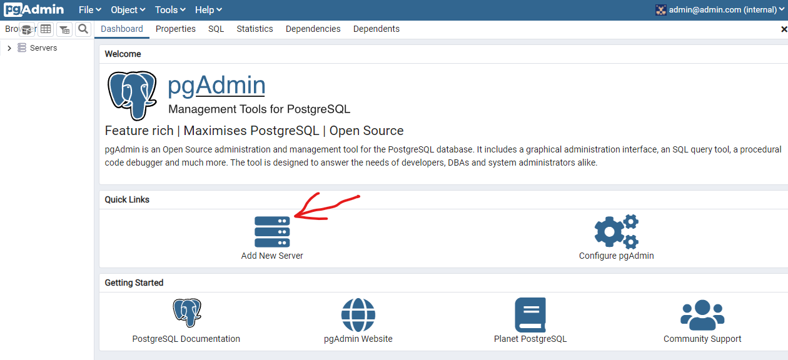
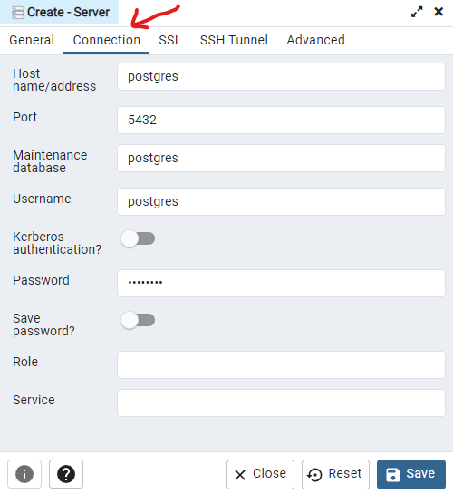

# Working Task

### Default Network
Switch to the `default` subdirectory and execute:
1. `docker-compose up -d`
2. `docker network ls`

3. Go to `http://localhost:8080` login with the pgadmin credentials and add the postgres database

4. Add a name for the server and switch to the connection tab
   

5. `docker-compose down`
6. `docker network ls`

### Custom Networks
Switch to the `networks` subdirectory and execute:
1. `docker-compose up -d`
2. `docker network ls`
3. Try to connect to the postgres instance again -> will not work
4. Add the `db` network to the list of networks under the pgadmin service and try again
5. `docker-compose -f docker-compose-other.yaml up -d`
6. Go to `http://localhost:8081`, login and try connecting to `postgres:5432`
7. `docker-compose -f docker-compose-other.yaml down`
8. `docker-compose down`
9. `docker network ls` -> make sure the `custom-db-network` no longer exists
10. `docker-compose -f docker-compose-other.yaml up -d` -> this will give an error

### Host Network
Switch to the `host` subdirectory and execute:
1. `docker run --rm --name ng1 --network host -d nginx`
2. Go to `http://localhost:80`
3. `docker run --rm --name ng2 --network host nginx`
4. `docker ps`
5. `docker run --rm --name ng2 -p 8081:80 -v /$PWD/mysite://usr/share/nginx/html -d nginx`
6. `docker exec -it ng1 bash`
    1. `curl localhost:8081`

# Additional Tasks

# Section Questions
1. Why can I not start two nginx server with the `--network host` flag?
2. 
